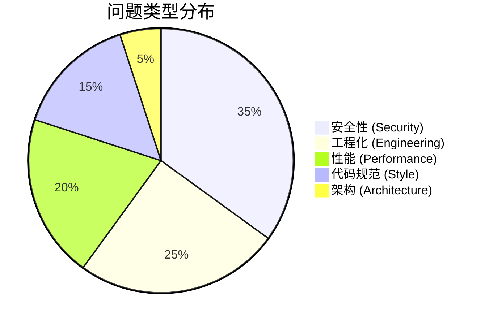
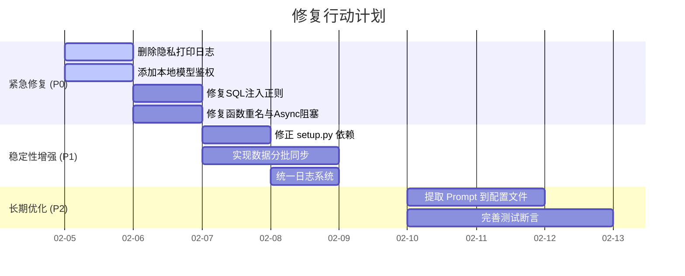

# XiYan MCP Server 代码质量全面审查报告

**生成日期**: 2026-02-05
**审查工具**: Multi-Agent Parallel Scan (Simulated)
**审查范围**: 全项目 (`src/`, `scripts/`, `tests/`)

---

## 1. 执行摘要 (Executive Summary)

本次审查通过四个独立维度的 Agent 对项目进行了全方位的深度扫描。总体而言，项目展示了清晰的 MCP 协议实现架构和对数据库操作的基本封装，但在**安全性（隐私泄露、SQL注入）**、**并发性能（Async阻塞）**以及**工程化规范（依赖管理、日志标准）**方面存在**高危风险**，需要立即着手修复。

### 核心指标概览

| 维度 | 评分 (0-10) | 关键发现 |
| :--- | :---: | :--- |
| **安全性** | **3.0** | ⚠️ **P0级风险**: 本地模型服务直接打印生成内容（含敏感数据），无任何鉴权；存在 SQL 注入隐患。 |
| **代码规范** | 6.5 | 整体结构清晰，但函数重名、变量命名不规范、日志库混用问题较多。 |
| **性能** | 5.0 | Async 函数中存在大量同步阻塞调用；大表同步可能导致 OOM。 |
| **可维护性** | 6.0 | 缺乏统一的 Prompt 管理；测试代码缺乏断言；依赖包名错误。 |

---

## 2. 详细问题列表 (Detailed Findings)

### 🔴 优先级：高 (High / P0) - 必须立即修复

#### 2.1 隐私与安全 (Privacy & Security)
1.  **敏感数据泄露**
    *   **位置**: `src/xiyan_mcp_server/local_model/local_xiyan_server.py:56`, `llama_cpp_server.py:114`
    *   **问题**: `print(generated_text)` 直接将模型生成的完整内容（可能包含用户隐私）打印到控制台/日志。
    *   **风险**: 极高。日志泄露是合规性红线。
    *   **建议**: **立即删除**相关 print 语句。

2.  **服务未鉴权**
    *   **位置**: `local_model/*.py` (Flask App)
    *   **问题**: 本地模型服务无任何 API Key 验证，任何网络可达者均可调用。
    *   **建议**: 添加 `Bearer Token` 验证中间件。

3.  **SQL 注入隐患**
    *   **位置**: `src/xiyan_mcp_server/utils/db_util.py` (`remove_sql_comments`)
    *   **问题**: 使用简单正则 `r'--[^\n]*'` 去除注释，会错误截断 SQL 字符串字面量（如 `SELECT 'lines -- comments'`）。
    *   **建议**: 使用 `sqlparse.format(strip_comments=True)`。

4.  **路径遍历漏洞**
    *   **位置**: `src/xiyan_mcp_server/utils/file_util.py`
    *   **问题**: 文件读写函数未校验路径，攻击者可通过 `../../` 访问系统敏感文件。
    *   **建议**: 强制校验文件路径必须在 `SAFE_BASE_DIR` 内。

#### 2.2 架构与稳定性 (Architecture & Stability)
5.  **Async 函数阻塞主线程**
    *   **位置**: `src/xiyan_mcp_server/server.py:314`
    *   **问题**: `async def read_resource` 内部调用了大量同步数据库操作（`get_db_engine`, `create_db_source`），阻塞事件循环。
    *   **建议**: 去掉 `async` 关键字让 MCP 框架处理，或使用 `run_in_executor`。

6.  **函数名冲突**
    *   **位置**: `src/xiyan_mcp_server/server.py` (L314 vs L358)
    *   **问题**: 定义了两个 `read_resource` 函数，后者覆盖前者。
    *   **建议**: 重命名第二个函数为 `read_table_resource`。

---

### 🟡 优先级：中 (Medium / P1) - 建议尽快修复

#### 2.3 性能 (Performance)
7.  **内存溢出 (OOM) 风险**
    *   **位置**: `src/xiyan_mcp_server/utils/db_source.py` (`sync_to_local`)
    *   **问题**: `session.query(table).all()` 一次性加载全表数据。
    *   **建议**: 使用 `yield_per(batch_size)` 进行流式分批处理。

8.  **全量 Schema 初始化慢**
    *   **位置**: `db_source.py`
    *   **问题**: 初始化时同步获取所有表的 `DISTINCT` 值。
    *   **建议**: 改为按需加载 (Lazy Loading)。

#### 2.4 工程化 (Engineering)
9.  **依赖包名称错误**
    *   **位置**: `setup.py`
    *   **问题**: `yaml` 应为 `PyYAML`。会导致安装失败。
    *   **建议**: 修正为 `PyYAML` 并锁定核心库版本（如 `pandas>=2.0.0`）。

10. **日志库混用**
    *   **位置**: `scripts/index_knowledge.py` vs `utils/logger_util.py`
    *   **问题**: 混用 `logging` 标准库和 `loguru`，日志格式不统一。
    *   **建议**: 统一使用 `logger_util`。

11. **测试无效**
    *   **位置**: `test.py`, `test_cockroachdb.py`
    *   **问题**: 仅打印输出，缺乏 `assert` 断言，无法自动验证正确性。
    *   **建议**: 添加状态码和响应内容的断言。

---

### 🟢 优先级：低 (Low / P2) - 优化项

*   **Prompt 硬编码**: `server.py` 中混杂了大量 Prompt 模板，建议提取到 `prompts.py`。
*   **Token 限制**: `embedding_service.py` 未处理超长文本截断，可能导致 API 报错。
*   **全局状态**: `server.py` 依赖大量 `global` 变量，不利于单元测试。

---

## 3. 趋势图表 (Trend Analysis)





---

## 4. 改进建议示例 (Code Improvement Examples)

### 4.1 修复 SQL 注入 (`db_util.py`)

**Before:**
```python
def remove_sql_comments(sql_query):
    return re.sub(r'--[^\n]*', '', sql_query) # ❌ 错误：会误删字符串内的内容
```

**After:**
```python
import sqlparse

def remove_sql_comments(sql_query: str) -> str:
    # ✅ 正确：使用解析器安全去除注释
    return sqlparse.format(sql_query, strip_comments=True).strip()
```

### 4.2 修复 Async 阻塞 (`server.py`)

**Before:**
```python
@mcp.resource(...)
async def read_resource(table_name): # ❌ Async 函数中
    engine = get_db_engine()         # ❌ 包含阻塞 I/O
    # ...
```

**After:**
```python
@mcp.resource(...)
def read_table_resource(table_name: str): # ✅ 去掉 async，改名避免冲突
    """Read table contents synchronously in thread pool."""
    engine = get_db_engine()
    # ...
```

### 4.3 修复 OOM 风险 (`db_source.py`)

**Before:**
```python
session.query(remote_table).all() # ❌ 一次性加载所有数据
```

**After:**
```python
# ✅ 使用流式分批读取
for batch in session.query(remote_table).yield_per(1000):
    process(batch)
```

---

## 5. 后续行动计划 (Next Steps)

1.  **立即执行**: 开发者应优先处理 **P0 级安全漏洞**，特别是删除 `local_model` 中的隐私日志打印。
2.  **本周内**: 修复 `server.py` 中的函数重名和 Async 阻塞问题，确保主服务稳定性。
3.  **下个迭代**: 修正 `setup.py` 依赖，重构日志系统，并引入自动化测试断言。

此报告由 **XiYan Code Reviewer Agent** 自动生成。
